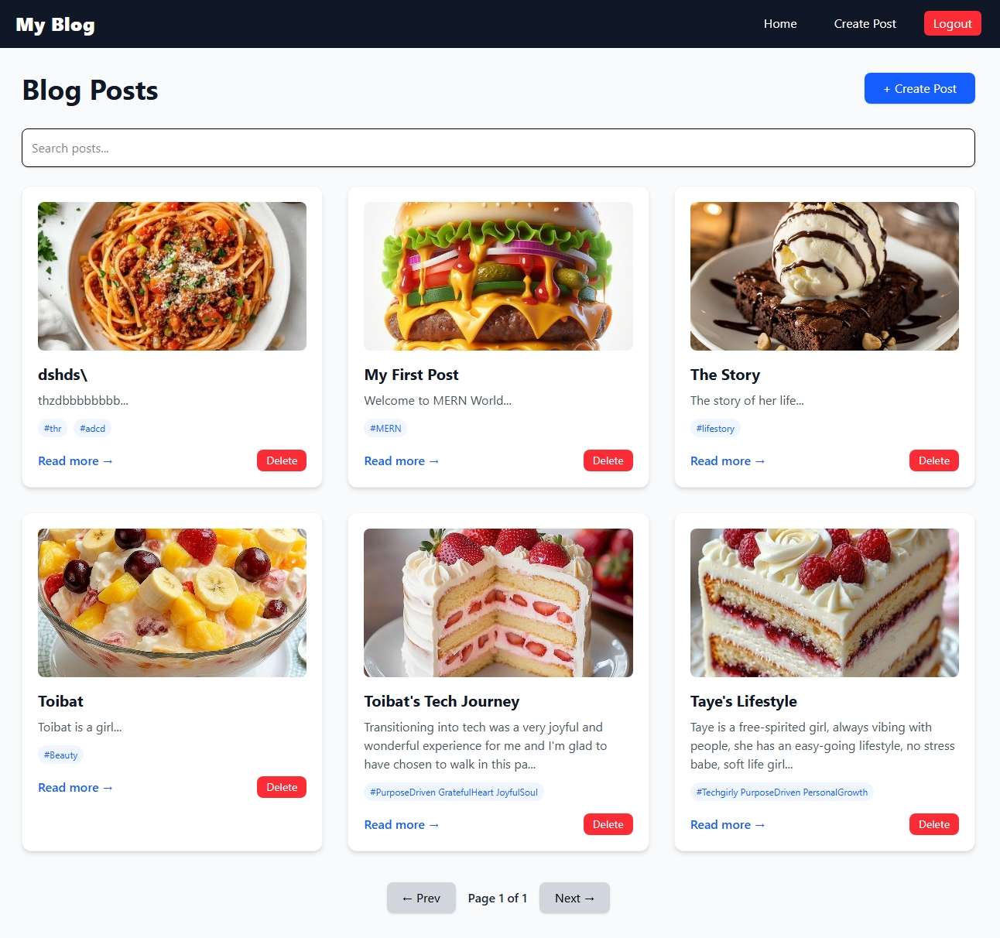
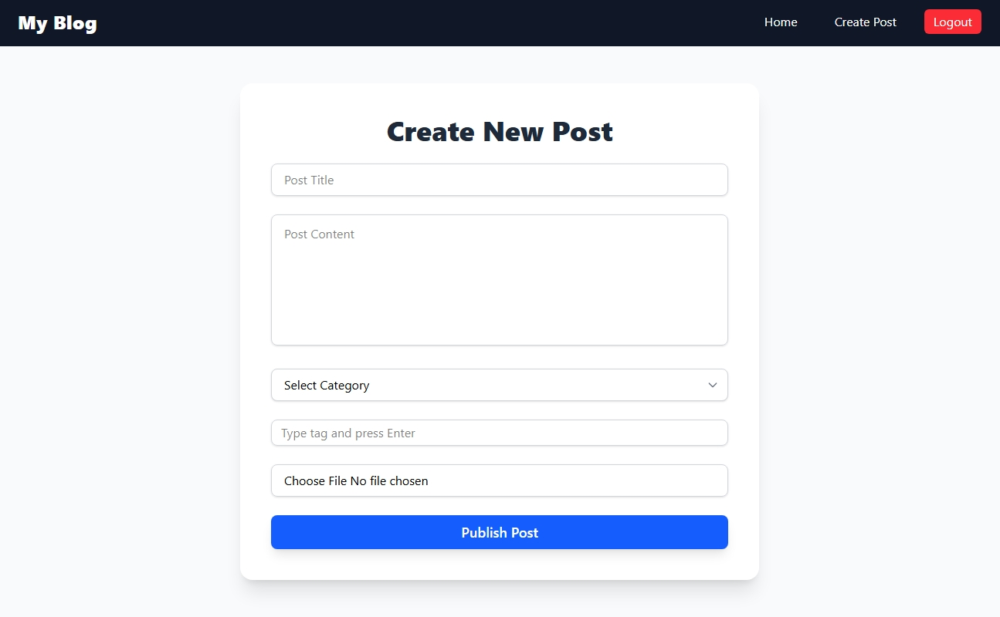
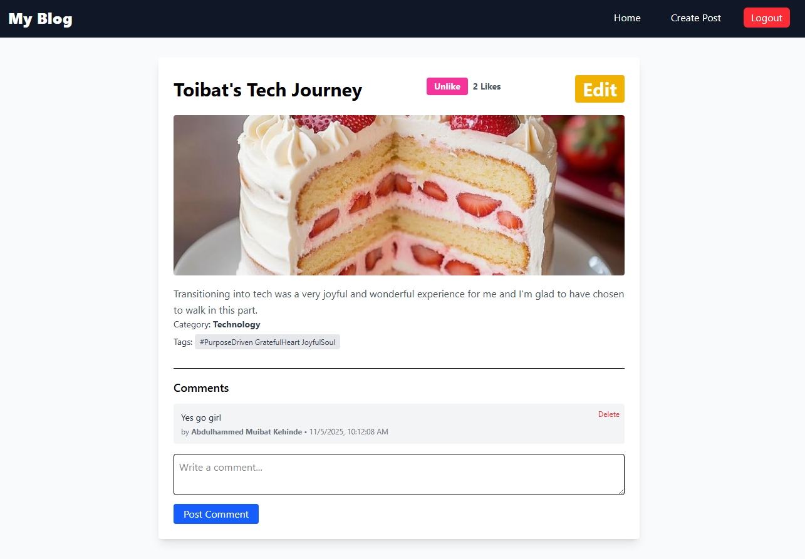
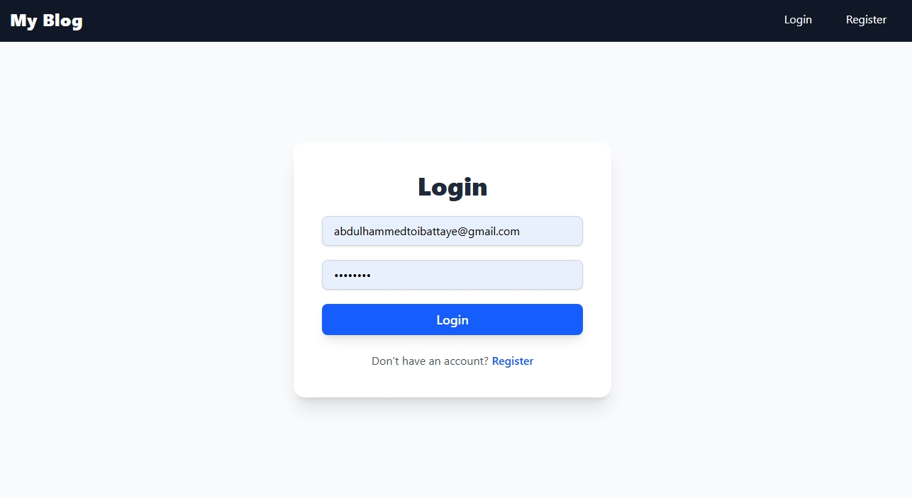
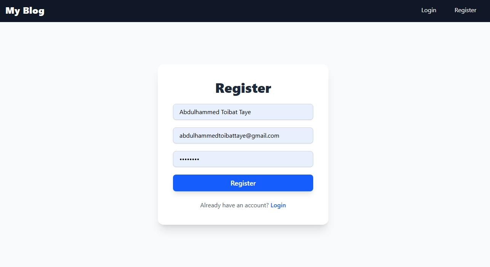

---

# MERN Blog Application

Project Overview

This is a full-stack MERN (MongoDB, Express.js, React.js, Node.js) blog application that allows users to create, read, update, and delete blog posts. Users can register, login, and interact with posts through likes, comments, and tags. The application demonstrates seamless integration between the front-end and back-end with advanced features such as image uploads, pagination, and search/filter functionality.

---

## Features Implemented

User Authentication

Registration, login, and protected routes for creating/editing posts.

Posts

Create, edit, delete, and view single posts.

Featured image upload for posts using Cloudinary.

Tagging of posts with comma-separated tags.

Like/unlike functionality.

Comments

Users can add and delete comments on posts.

Only authors or post owners can delete comments.

Categories

Assign posts to categories.

Create and fetch categories from the backend.

Pagination

Posts are paginated for better user experience.

Search & Filter

Search posts by keywords.

Filter posts by categories.

Responsive UI

Built with Tailwind CSS for a clean and responsive user interface.

Optimistic UI Updates

Likes and comments update immediately without page refresh.

---

## Project Structure

mern-blog/
│
├── client/                     # React frontend
│   ├── src/
│   │   ├── assets/             
│   │   │   
│   │   ├── components/         # Reusable components (Navbar, etc.)
│   │   ├── Pages/              # Pages like Home, Login, Register, CreatePost
│   │   ├── services/           # API services (axios instances)
│   │   ├── App.jsx              # Main App component with routes
│   │   └── main.jsx             # Entry point
│   ├
│   └── package.json
│
├── server/                     # Express backend
│   ├── controllers/            # Route handlers / business logic
│   ├── models/                 # Mongoose models (User, Post, Category)
│   ├── routes/                 # Express routes (auth, posts, categories)
│   ├── middleware/             # Auth middleware, error handling
│   ├── config/                 # DB connection, Cloudinary config
│   ├── .env                     # Backend environment variables
│   ├── .env.example
│   ├── server.js               # Entry point for backend
│   └── package.json
├──screeshots/│                 # Screenshots for README
├── README.md
└── .gitignore

### Server

server/models – Mongoose models for Post, Category, and User.

server/routes – API routes for posts, categories, and authentication.

server/controllers – Logic for handling requests.

server/middleware – Authentication and error-handling middleware.

server/.env – Environment variables (MongoDB URI, JWT secret, Cloudinary keys).

Client

client/src/components – Reusable UI components (Navbar, etc.).

client/src/Pages – Pages like Home, Login, Register, CreatePost, SinglePost.

client/src/services/api.js – Axios service for API requests.

---

## Setup Instructions

Prerequisites

Node.js v18+

MongoDB installed locally or use MongoDB Atlas

Server

1. Navigate to the server folder:

cd server

2. Install dependencies:

pnpm install

3. Create a .env file based on .env.example:

MONGODB_URI=mongodb://localhost:27017/mern_blog
JWT_SECRET=your_jwt_secret
PORT=5000
NODE_ENV=development
CLOUDINARY_CLOUD_NAME=your_cloud_name
CLOUDINARY_API_KEY=your_cloud_api_key
CLOUDINARY_API_SECRET=your_cloud_api_secret

4. Start the server:

pnpm run dev

Client

1. Navigate to the client folder:

cd client

2. Install dependencies:

pnpm install

3. Start the client:

pnpm run dev

---

## API Documentation

Posts

Method Endpoint Description

GET /api/posts Get all posts
GET /api/posts/:id Get a single post
POST /api/posts Create a new post
PUT /api/posts/:id Update a post
DELETE /api/posts/:id Delete a post
PUT /api/posts/:id/like Like/unlike a post
POST /api/posts/:id/comment Add a comment
DELETE /api/posts/:id/comment/:commentId Delete a comment

Categories

Method Endpoint Description

GET /api/categories Get all categories
POST /api/categories Create a category

Authentication

Method Endpoint Description

POST /api/auth/register Register a new user
POST /api/auth/login Login user and get JWT

---

Screenshots

## Screenshots

### Home Page

### Create Post

### Single Post View

### Login Page View

### Register Page View

---

Notes

All forms have client-side validation to prevent empty inputs.

Protected routes ensure only authenticated users can create or edit posts.

Cloudinary is used for storing uploaded images.

Pagination, search, and filtering enhance the user experience.

## AUTHOR
ABDULHAMMED TOIBAT TAYE

